

<a href="image/box_01_19.png">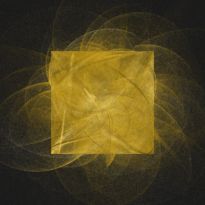</a> <a href="image/box_01_20.png">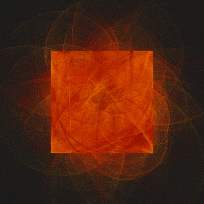</a> <a href="image/box_01_21.png">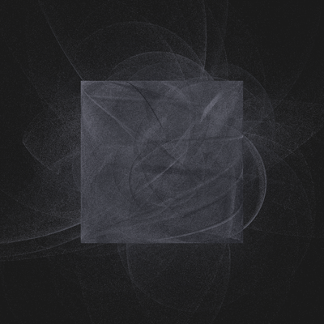</a> <a href="image/box_01_22.png">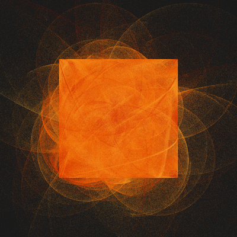</a> <a href="image/box_01_24.png">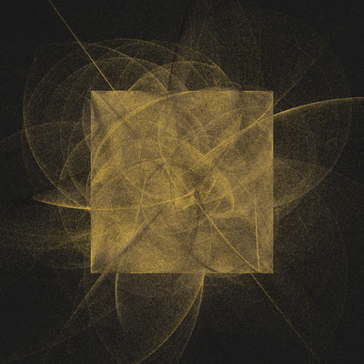</a> <a href="image/box_01_25.png">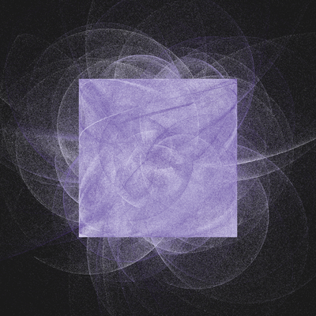</a> <a href="image/box_01_26.png">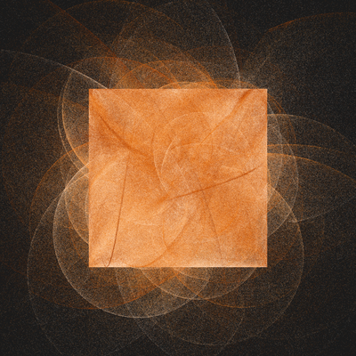</a> <a href="image/box_01_27.png">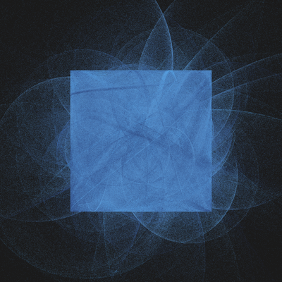</a> <a href="image/box_01_28.png">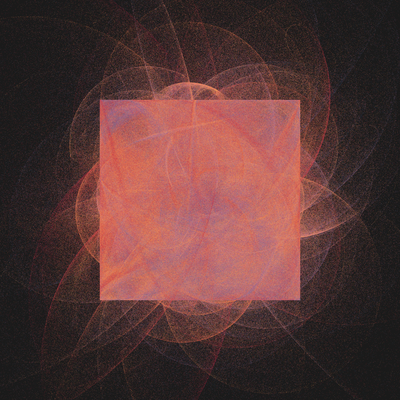</a> <a href="image/box_01_29.png">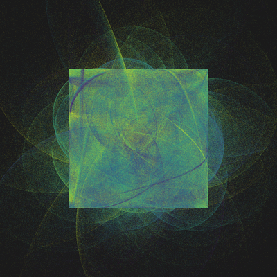</a> <a href="image/box_01_30.png">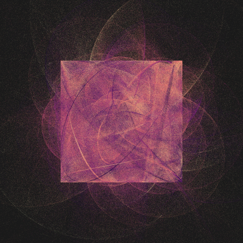</a> <a href="image/box_01_31.png">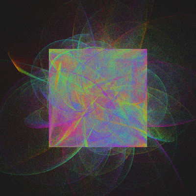</a> <a href="image/box_01_32.png">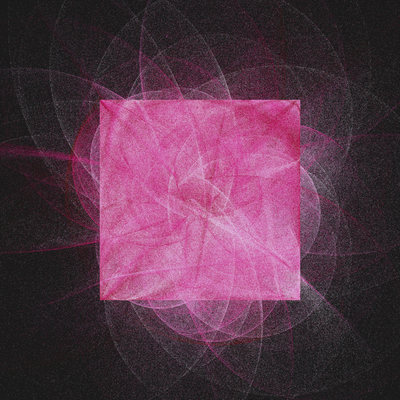</a> <a href="image/box_01_33.png">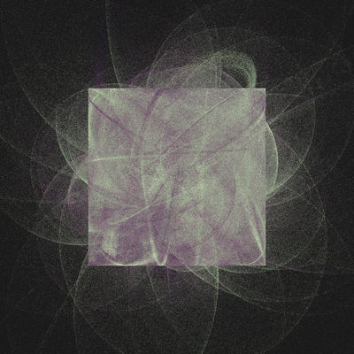</a> <a href="image/box_02_2.png">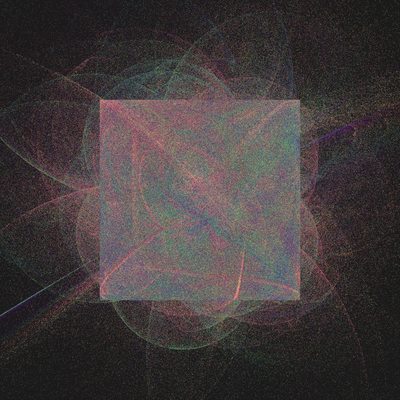</a> <a href="image/box_02_4.png">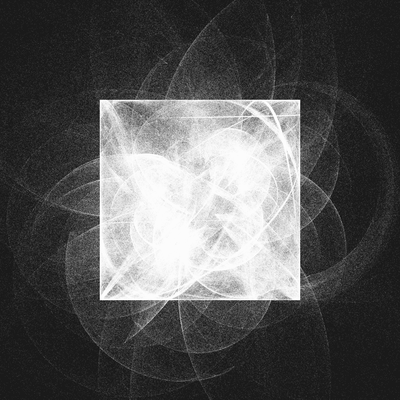</a> <a href="image/box_02_5.png">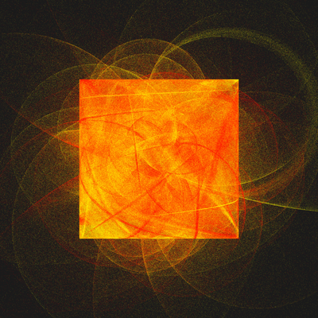</a> <a href="image/box_02_6.png">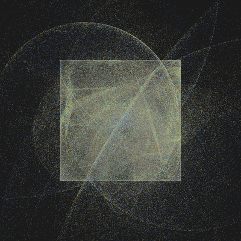</a> <a href="image/box_03_1.png">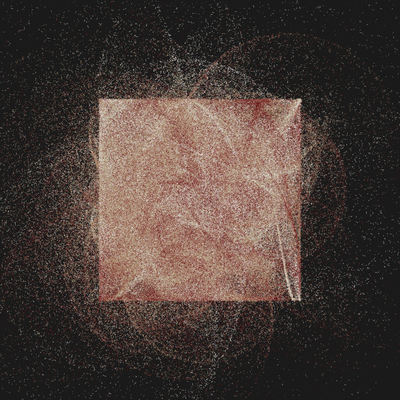</a> <a href="image/box_03_2.png">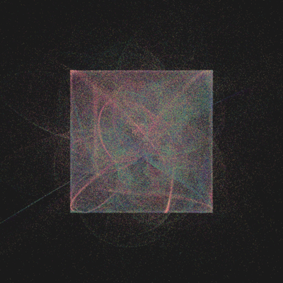</a> <a href="image/box_03_6.png">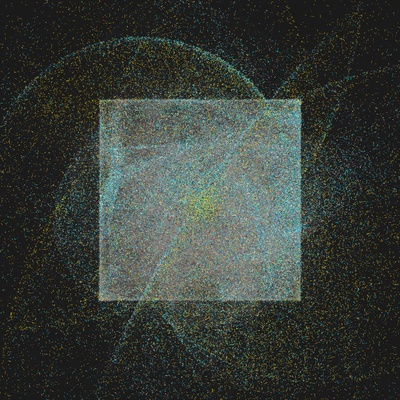</a>  <a href="image/box_03_8.png">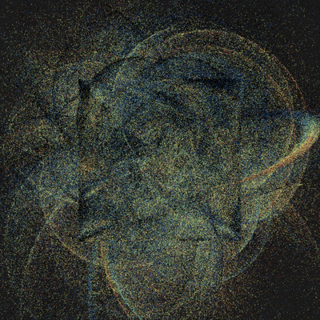</a> <a href="image/box_03_9.png">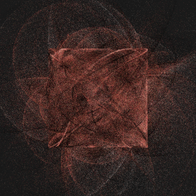</a>

