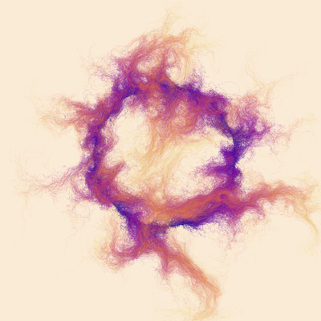
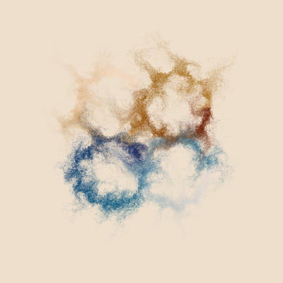
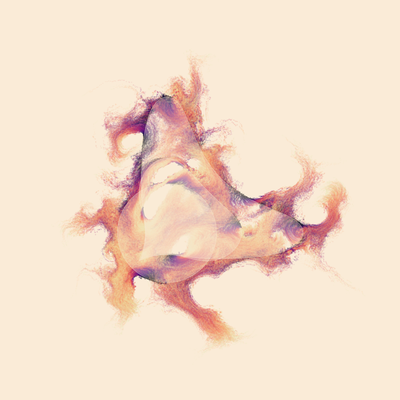
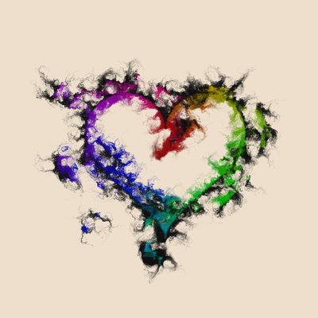
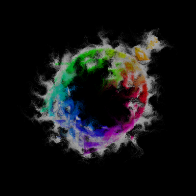
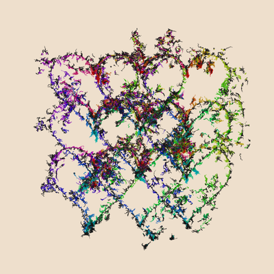
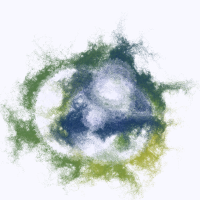

"Mental states of every kind, -- sensations, feelings, ideas, -- which were at one time present in consciousness and then have disappeared from it, have not with their disappearance absolutely ceased to exist. Although the inwardly-turned look may no longer be able to find them, nevertheless they have not been utterly destroyed and annulled, but in a certain manner they continue to exist, stored up, so to speak, in the memory. We cannot, of course, directly observe their present existence, but it is revealed by the effects which come to our knowledge with a certainty like that with which we infer the existence of the stars below the horizon." (Hermann Ebbinghaus)

       

