> Fractious petals, stop interrupting me with your boring beauty (Jennifer Chang)

<a href="image/001_flametree_20_13.png">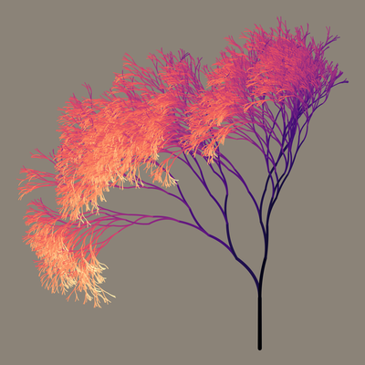</a> <a href="image/002_flametree_21_13.png">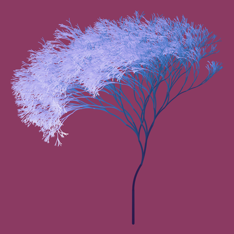</a> <a href="image/003_ashtree2.png">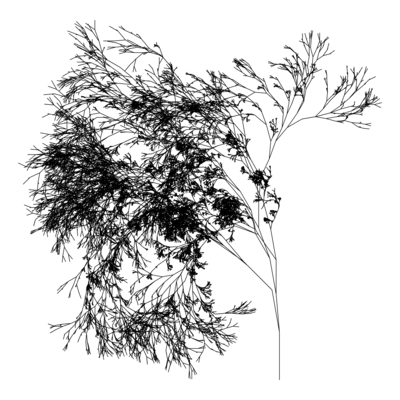</a>  <a href="image/005_ft_298a.png">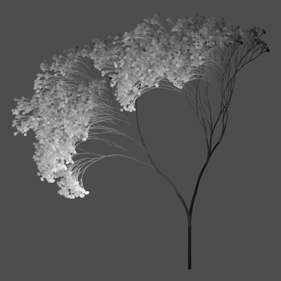</a> <a href="image/006_ft_298b.png">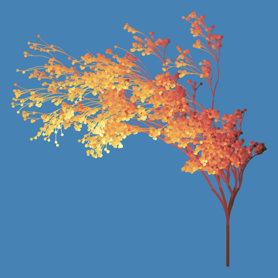</a> <a href="image/007_ft_298d.png">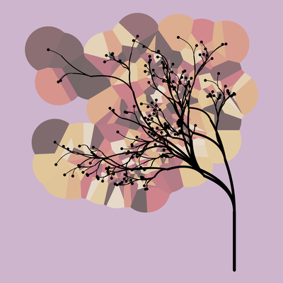</a>  <a href="image/009_ft_299f.png">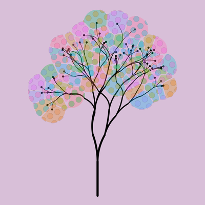</a> <a href="image/010_ft_299g.png">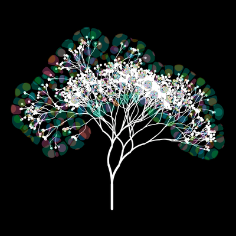</a> <a href="image/011_ft_299h.png">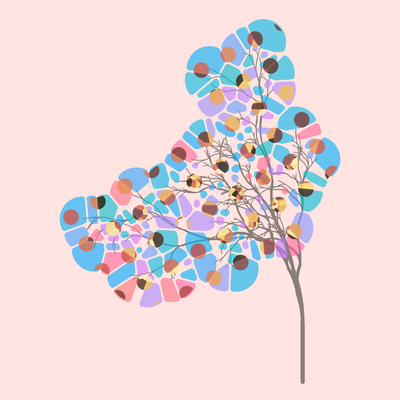</a> <a href="image/012_ft_299j.png">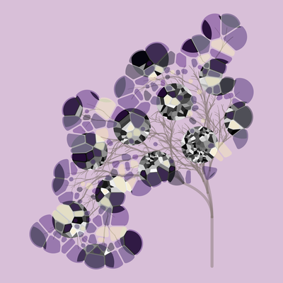</a> <a href="image/ft_302_01.png">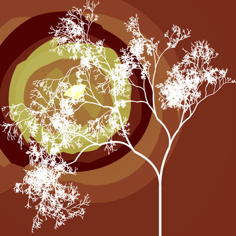</a> <a href="image/ft_302_02.png">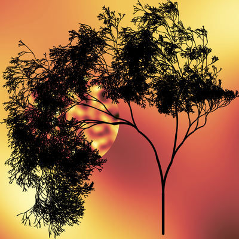</a> <a href="image/ft_303_03.png">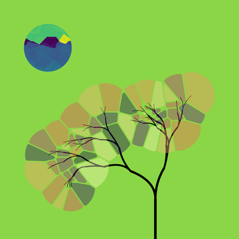</a> <a href="image/ft_303_04.png">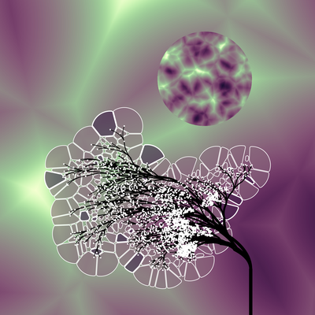</a>

  

I have a soft spot for the [flametree](https://github.com/djnavarro/flametree) package and series. The algorithm it uses is a simple [L-system](https://en.wikipedia.org/wiki/L-system), and was easier to implement than I had been expecting. It was rather popular on twitter. Not only did other people use it, Tyler Morgan-Wall made a very cool 3d version called [raybonsai](https://www.tylermw.com/raybonsai-generate-procedural-3d-trees-in-r/). I've even managed to use it in my own teaching. The most bizarre thing, however, is the fact that I wrote the code in April 2020 and although I'm writing this summary a few months later, it feels like a lifetime ago.

