> Possibly, behind the diverse behaviors of humans and animals, as behind the various motions of planets and stars, we may discern the operation of universal laws (Roger Shepard)

<a href="image/rectgenerate_1_12.png">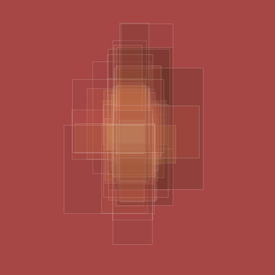</a>

<a href="image/rectgenerate_1_13.png">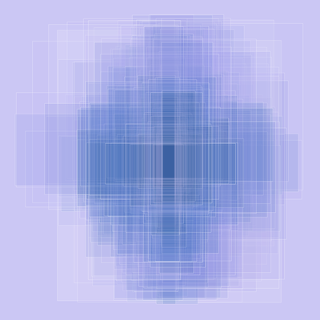</a>

<a href="image/rectgenerate_1_14.png">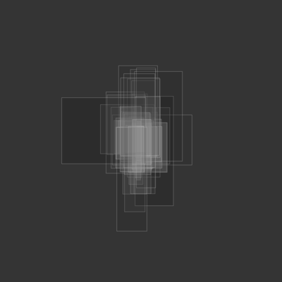</a>

<a href="image/rectgenerate_1_24.png">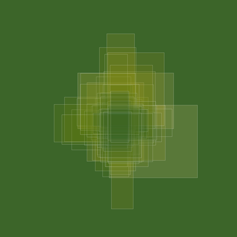</a>

<a href="image/rectgenerate_1_3.png">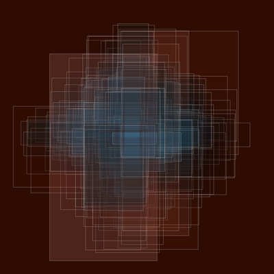</a>

<a href="image/rectgenerate_1_31.png">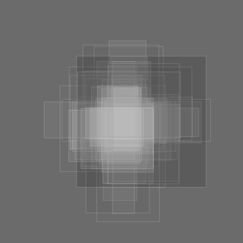</a>

<a href="image/rectgenerate_3_12.png">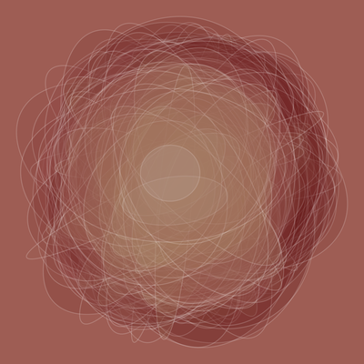</a>

<a href="image/rectgenerate_3_28.png">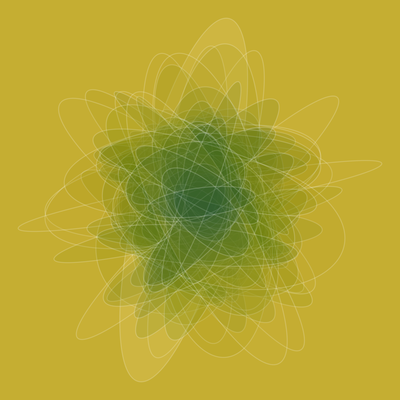</a>

<a href="image/rectgenerate_3_35.png">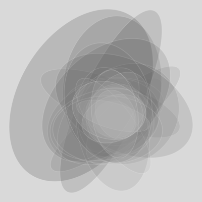</a>

<a href="image/rectgenerate_3_39.png">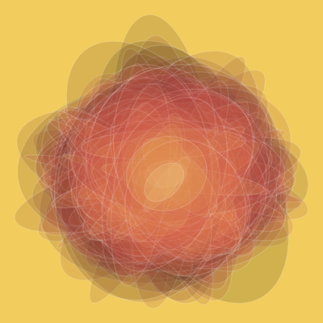</a>

<a href="image/rectgenerate_3_43.png">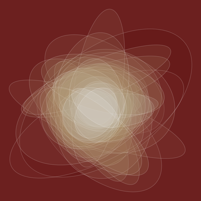</a>

<a href="image/rectgenerate_3_47.png">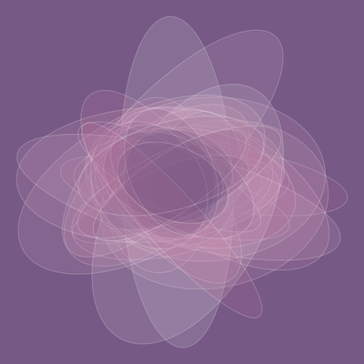</a>

Inspired by Figure 1 of [this paper](https://psyarxiv.com/ygbjp/).

