> "There's rosemary, that's for remembrance, pray you love, remember" (William Shakespeare)

<a href="image/001-one_art_please.png">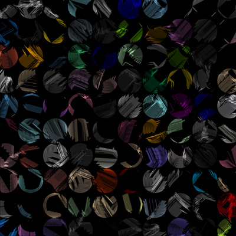</a> <a href="image/002-paper_cuts.png">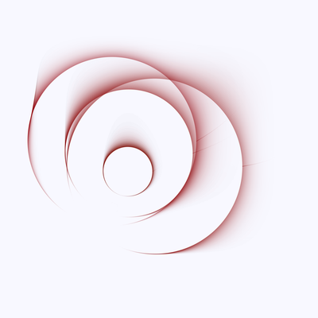</a> <a href="image/003-rainbow_prisms.png">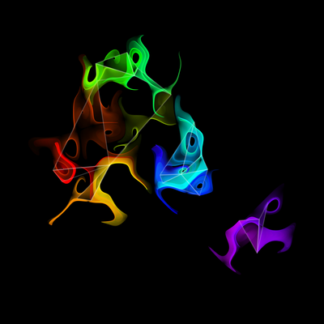</a> <a href="image/004-incantations.png">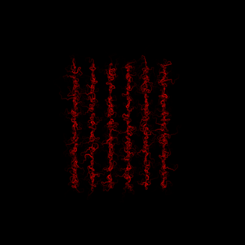</a> <a href="image/005-cubismic_rainbow.png">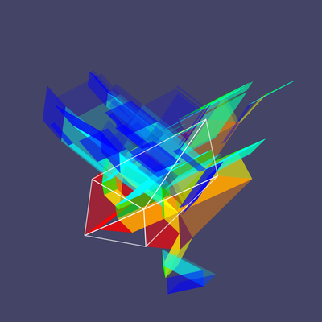</a> <a href="image/006-stars_and_the_night_sky.png">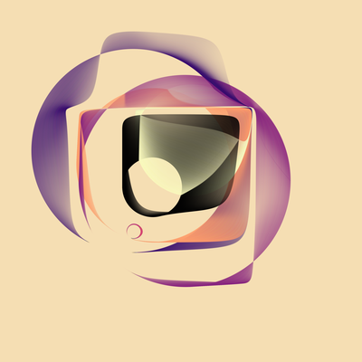</a> <a href="image/007-fracture.png">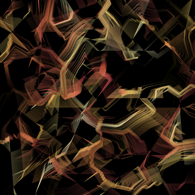</a> <a href="image/008-wispy_heart_bright.png">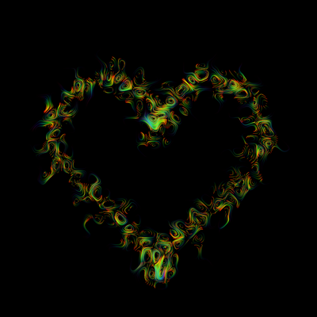</a> <a href="image/009-forgotten_worlds.png">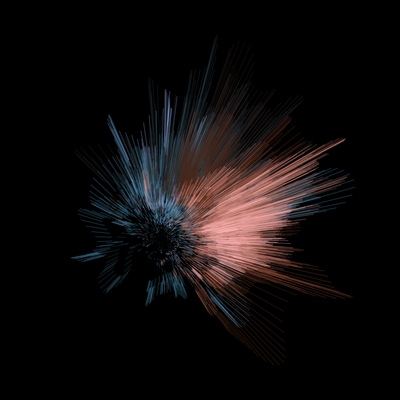</a> <a href="image/010-sometime_angry.png">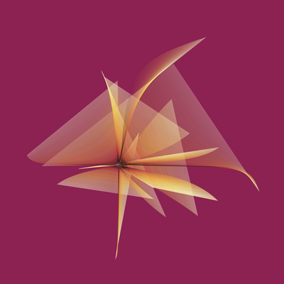</a> <a href="image/011-regret.png">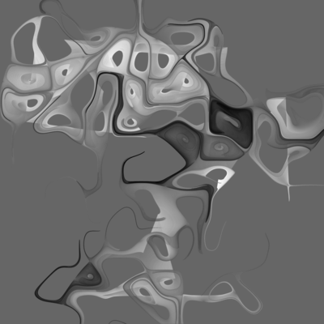</a> <a href="image/012-constellations.png">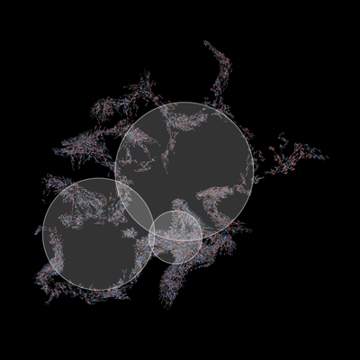</a>

  

This series was my first sustained attempt to make generative art using R. The code is distributed over two small R packages: the [jasmines](https://github.com/djnavarro/jasmines) package contains helper functions that I used to create the art, and the [rosemary](https://github.com/djnavarro/rosemary) package that generates specific pieces. I chose the name jasmines for the underlying engine partly because it's one of my favourite flowers, but also because Jasmine is my middle name and I sometimes think of "Jasmine" as the version of me who pursues artistic rather than scientific endeavours. I chose rosemary not just because I love rosemaries, but because I associate rosemary hedges with my mum who taught me to garden, and making generative artwork reminds me a lot of gardening.

