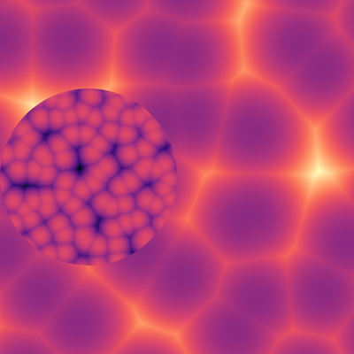
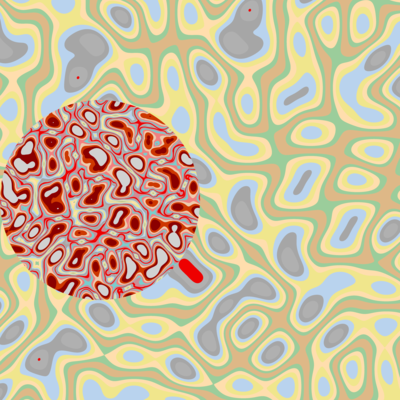
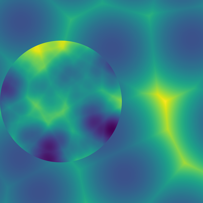
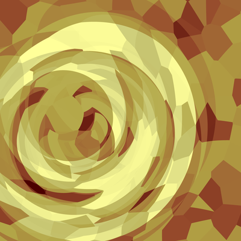
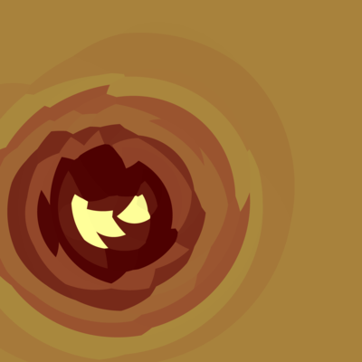
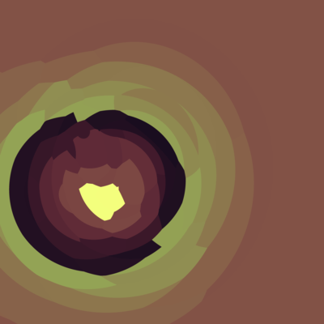

> I know who I was when I got up this morning, but I think I must have been changed several times since then (Lewis Carroll)

       

  

The weird thing about this series is that there is an entire [R package](https://github.com/djnavarro/scopes) for it that I honestly cannot remember writing. According to the commit logs I released the source code sometime in May 2020. Sure, the past is a foreign country, but you can still visit it on github.

