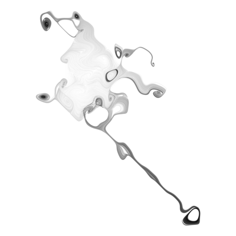
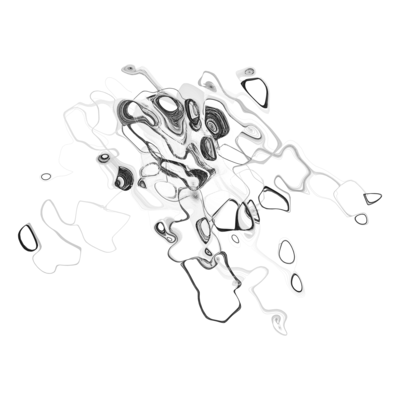
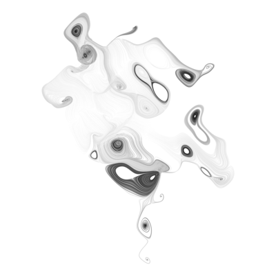
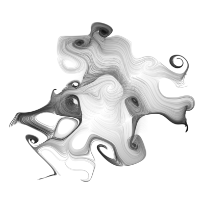
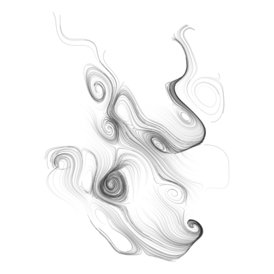
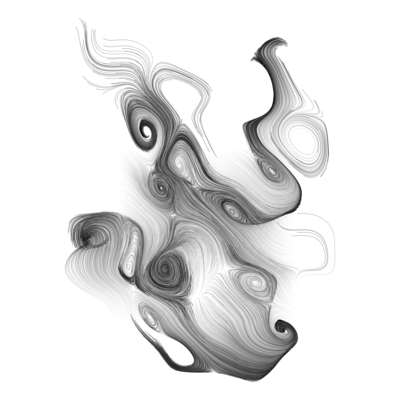
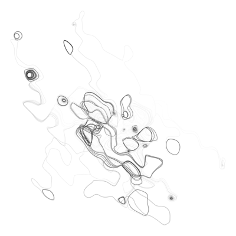

> I must confess I've made a mess of what should be a small success. But I digress at least I've tried my very best I guess (Courtney Barnett)

       

  

I came up with [scrawl](https://github.com/djnavarro/scrawl) as a teaching exercise. I wanted something fun and artistic I could get students to play with that would "accidentally" teach programming concepts in the process. To my eternal shame there is [YouTube video](https://www.youtube.com/watch?v=ZUyahWLWVzY&list=PLRPB0ZzEYegNYW3ksiK3dvd6S4HMfKj1n) of me explaining how the system works.

