

<a href="image/vstone_01.png">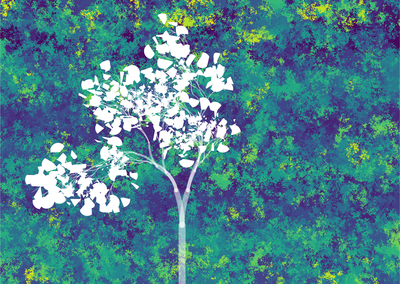</a> <a href="image/vstone_02.png">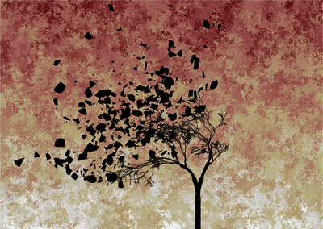</a> <a href="image/vstone_03.png">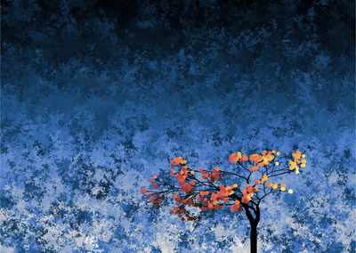</a> <a href="image/vstone_04.png">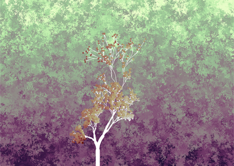</a> <a href="image/vstone_05.png">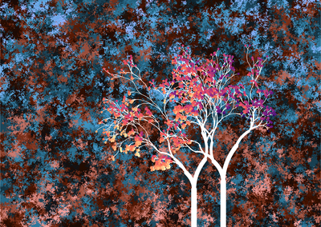</a> <a href="image/vstone_06.png">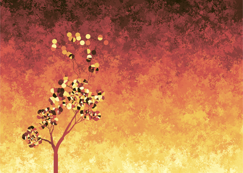</a> <a href="image/vstone_07.png">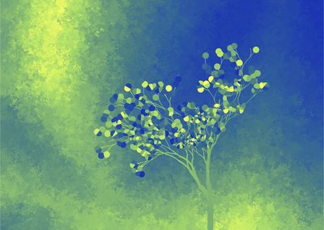</a> <a href="image/vstone_08.png">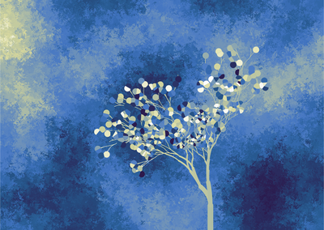</a> <a href="image/vstone_09.png">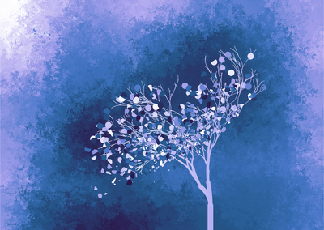</a> <a href="image/vstone_10.png">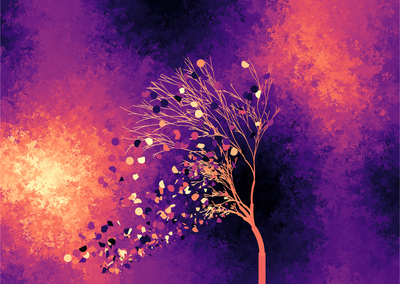</a>  <a href="image/vstone_12.png">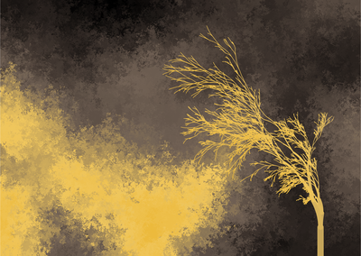</a>

