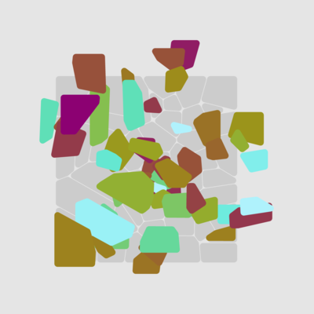
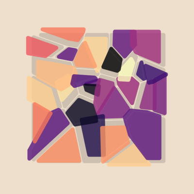
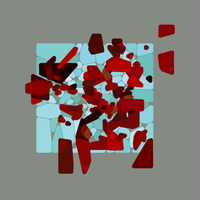
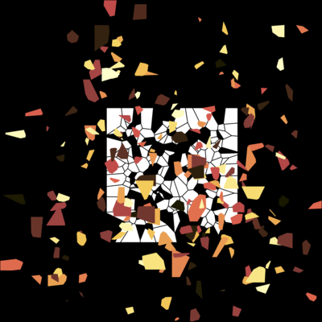
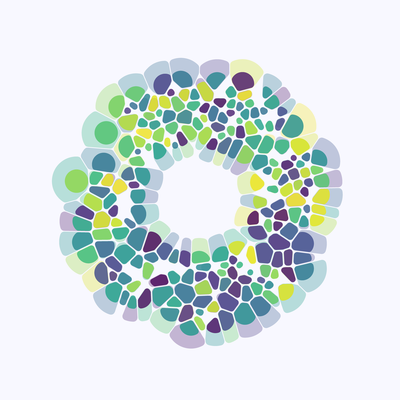
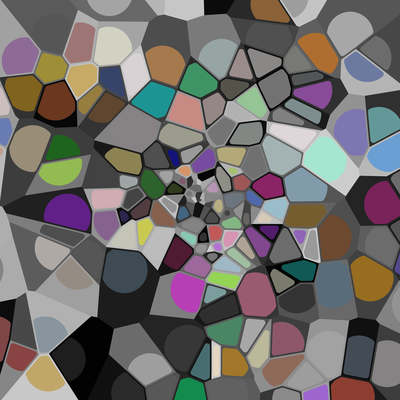
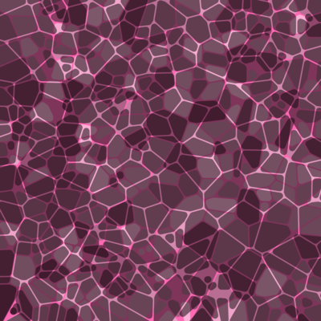
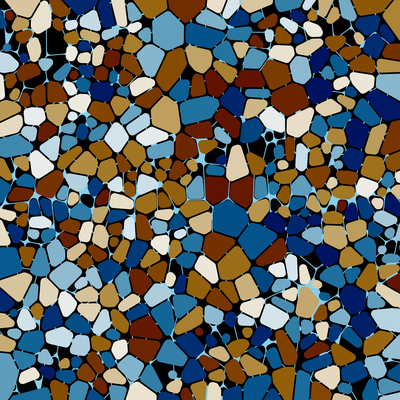

> "I've been a bad bad girl I've been careless with a delicate man and it's a sad sad world when a girl will break a boy just because she can" (Fiona Apple)

       

  

Oh [voronoise](https://github.com/djnavarro/voronoise), what can I say about you? You were my first attempt to understand ggplot2 internals. You gave me the banner image for my [academic website](https://djnavarro.net) and for the [calade blog theme](https://djnavarro.github.io/hugo-calade/), my first foray into building literate programming tools. You made a guest appearance in my first ever [commissioned artwork](https://github.com/djnavarro/rstudiopostcard). I love you dearly, but I suspect voronoise\_08 will make me bitter and frightened until the day I die.

